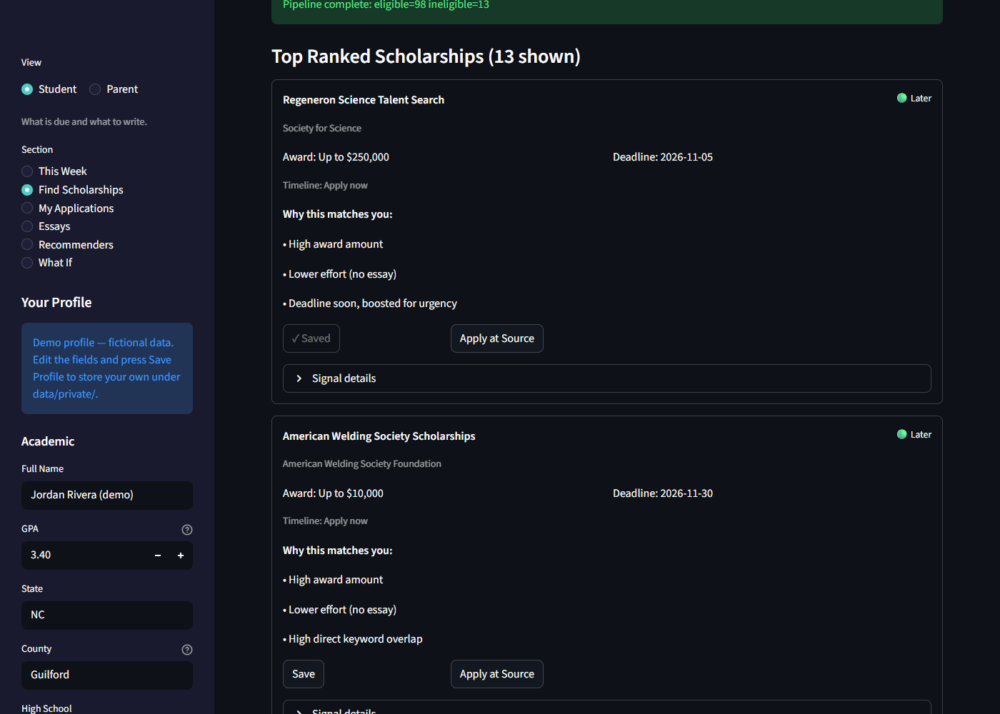
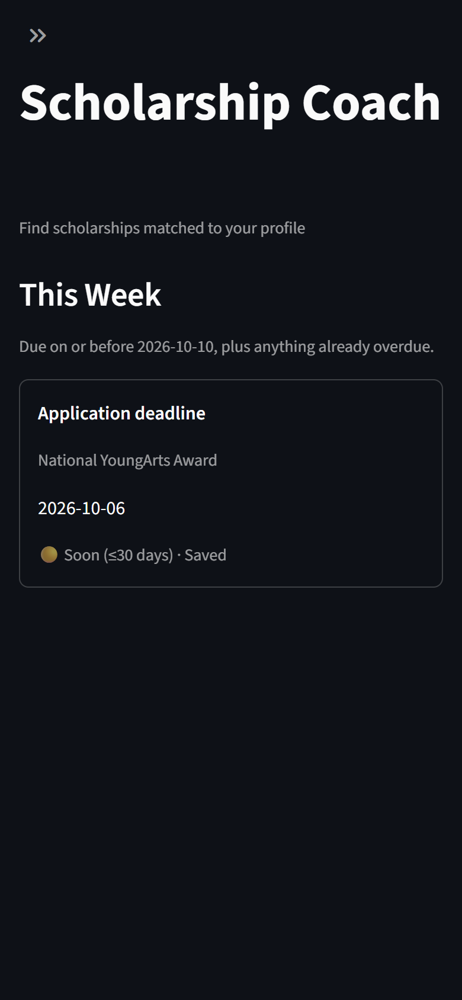
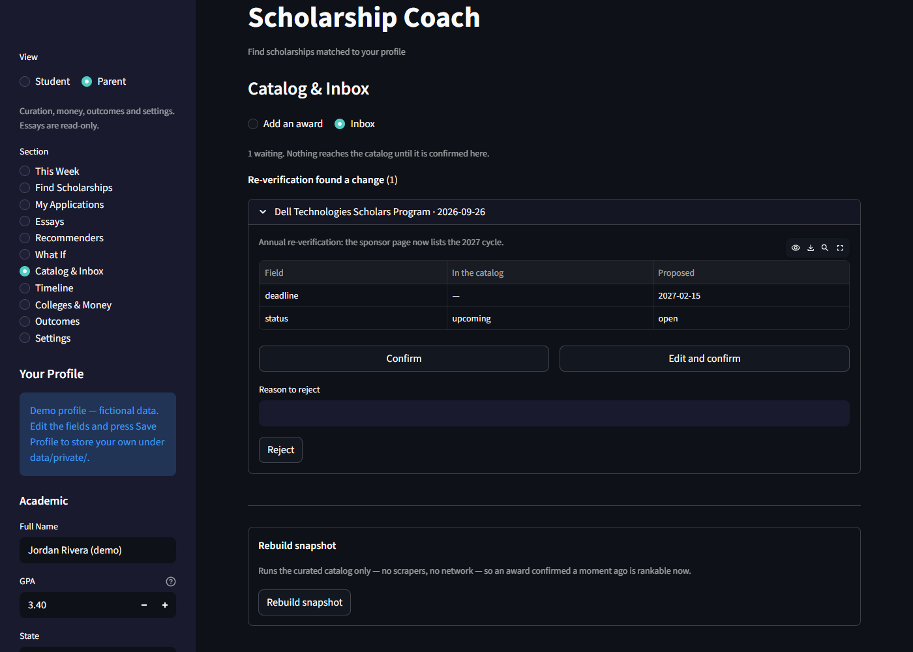

<div align="center">

# ScholarshipCoach

### A scholarship decision-support tool for one family, with a recommender inside

[](https://github.com/daedwards06/ScholarshipCoach/actions/workflows/ci.yml)
[](https://github.com/daedwards06/ScholarshipCoach)
[](https://www.python.org/)
[](https://streamlit.io/)
[](https://github.com/astral-sh/ruff)

</div>

---

## What this is

**ScholarshipCoach answers four questions for a student and her parent:** which awards she can
actually apply to, when each one is due, what each one needs written, and how the outside money
compares to the institutional and state aid that is usually the larger number.

It runs on a home PC, is opened from a phone on the same Wi-Fi, and has no public deployment —
it holds a real student's profile, essays and application history.

Ranking is one component of that, not the product. A deterministic four-stage pipeline filters on
eligibility, buckets awards onto the student's timeline, scores semantic fit, and reranks by a
weighted composite. Everything downstream of ingest is a pure function of catalog plus profile
plus date, so a run is reproducible and a result is explainable to the person acting on it.

### What it does

| | |
|---|---|
| **Catalog** | Hand-curated JSON records plus a licensed structured feed. Automation proposes into an inbox; a person confirms before anything counts |
| **Eligibility** | Filters on major, state, county, education level, grade, GPA, test scores, citizenship, need, first-gen, heritage, military, disability, religion, employer and membership — 20 reason codes, one per way an award can be ruled out |
| **Timeline** | Every surviving award lands in `now`, `next_cycle`, `senior_year`, `expired` or `not_applicable`, with the next cycle projected for recurring awards |
| **Tracker** | Applications, per-award checklists, milestones, calendar export |
| **Essays** | Versioned essay bank linked to the applications that reuse each one; recommender requests |
| **Colleges and money** | Outside awards sized against institutional and state aid |
| **What-if** | What a higher GPA, a test score or more service hours would unlock, in awards and dollars |
| **Modes** | Student (daily view), parent (curation, money, settings), operator (pipeline controls, off by default) |

---

## Table of Contents

- [What this is](#what-this-is)
- [Family product vs. portfolio library](#family-product-vs-portfolio-library)
- [Data sources](#data-sources)
- [System architecture](#system-architecture)
- [Evaluation results](#evaluation-results)
- [Limitations & evaluation honesty](#limitations--evaluation-honesty)
- [Multi-objective tuning](#multi-objective-tuning)
- [Win probability model (retired from the product)](#win-probability-model-retired-from-the-product)
- [Quick start](#quick-start)
- [Screenshots](#screenshots)
- [Project structure](#project-structure)
- [Design principles](#design-principles)
- [Future work](#future-work)
- [Author](#author)

---

## Family product vs. portfolio library

This repository is one codebase serving two purposes, and the split is deliberate: **general in
shape, specific in content.**

The code, the schema and the roles never know the student exists. Every eligibility axis, every
mode, every table is written for "a student"; nothing is special-cased for hers. Her data — profile,
essays, applications, outcomes — lives in git-ignored `data/private/`, and a fictional demo profile
(`data/demo/student_demo.json`) ships so a fresh clone runs end to end.

| | Family product | Portfolio library |
|---|---|---|
| **Audience** | One student and her parent | Anyone reading the code |
| **Surfaces** | Student and parent modes; the tracker, essays, timeline, money | The ranking stages, evaluation harness, tuner, win model |
| **Data** | `data/private/` — never committed | Committed catalog, golden profiles, snapshots |
| **Judged by** | Did she find and submit an award she would have missed? | Is the measurement honest and reproducible? |

Two things follow from the split, and both are visible in this README:

1. **Features are gated on one test:** does it help the student by her senior-year application
   season (fall 2028)? General capability that fails the test waits in
   [Future work](#future-work) rather than shipping half-used.
2. **A component can be good engineering and still not belong in front of a family.** The win
   model is the worked example — see [below](#win-probability-model-retired-from-the-product).

A dated record of these calls, with the evidence behind each, is in
[`docs/decisions.md`](docs/decisions.md).

---

## Data sources

There is no open dataset of US private or local scholarships. Aggregators keep listings
proprietary; the awards with the smallest applicant pools — counselor lists, community
foundations, employers, churches, credit unions — appear in no aggregator at all. The catalog is
therefore **curated first, fed second, scraped last.**

Which connectors run is configuration, not code: `data/catalog/sources.json` carries an `enabled`
flag and a dated note per source.

| Source | Trust | Records | License / terms |
|---|---|---:|---|
| `curated_catalog` — hand-curated records in `data/catalog/records/` | `verified_local` | 3 | Project-owned |
| `open_scholarships` — [Open Scholarships](https://github.com/Grudged/open-scholarships) structured API feed | `structured_feed` | 102 | CC BY 4.0 |
| `scholarship_america` — public listing scrape | — | disabled | Awards enter through the inbox (URL prefill) instead |
| `bold_org` | — | disabled | Client-rendered listing; returned 0 records since June 2026 |

*Counts are from `scholarships_snapshot_20260919.parquet` (105 records)*, a curated-only rebuild:
the three catalog records were re-parsed and the 102 `open_scholarships` rows were carried forward
from the prior snapshot. `scholarship_america` contributed nothing in that build: every run capped
it to zero listing pages, and the health check reported
`Source 'scholarship_america' returned 0 records but returned 13 on the prior run` each time. It
is now disabled, and awards found on its site come in through the catalog inbox via URL prefill
and are confirmed there, like any other lead. A source capped to zero pages now reports `skipped`
rather than a regression, so the zero-record alarm fires only when a source actually tried to fetch
and came back empty. A silent `succeeded` on exactly that condition is how the catalog collapsed
from 166 records to 35 without anyone noticing.

Open Scholarships data is used under [CC BY 4.0](https://creativecommons.org/licenses/by/4.0/)
and attributed as required:

> Open Scholarships by Grudged LLC - https://github.com/Grudged/open-scholarships (CC BY 4.0)

The same attribution and license travel with every ingested record in its `provenance` field, into
every snapshot built from it.

**Automation proposes, a person confirms.** Feeds, URL prefill and annual re-verification write
proposals into `data/catalog/inbox/` with a field-level diff against the record they would replace.
`confirm()` is the only path into `data/catalog/records/`, and it validates against
`data/catalog/schema.json` first. Only confirmed records, or records from a trusted structured
feed, count as eligible: Stage 1 rejects `trust: unverified` and `trust: aggregator` with the
reason code `TRUST_UNCONFIRMED`. A record with no `trust` at all passes, so pre-catalog snapshots
still rank. Operator mode's "Include unconfirmed records" toggle disables the rule for pipeline
inspection; the family-facing path always enforces it.

---

## System architecture

```
Curated records + structured feeds + scrapes
    │
    ▼
┌──────────────────────────────────────────────────────────┐
│  Inbox — proposals with field-level diffs                 │
│  A person confirms · schema-validated on the way in       │
└────────────────────────┬─────────────────────────────────┘
                         │
                         ▼
┌──────────────────────────────────────────────────────────┐
│  Stage 0 — Candidate Retrieval                           │
│  Stable catalog IDs · Snapshot versioning (Parquet)      │
│  Connector health checks · Change tracking (JSON)        │
└────────────────────────┬─────────────────────────────────┘
                         │
                         ▼
┌──────────────────────────────────────────────────────────┐
│  Stage 1 — Eligibility Filtering                         │
│  20 reason codes · Unverified-field flags                │
│  Status and deadline enforcement                         │
└────────────────────────┬─────────────────────────────────┘
                         │
                         ▼
┌──────────────────────────────────────────────────────────┐
│  Timeline Bucketing                                      │
│  now · next_cycle · senior_year · expired · n/a          │
│  Next-cycle projection for recurring awards              │
└────────────────────────┬─────────────────────────────────┘
                         │
                         ▼
┌──────────────────────────────────────────────────────────┐
│  Stage 2 — Semantic Scoring                              │
│  TF-IDF or SentenceTransformer (all-MiniLM-L6-v2)        │
│  Keyword overlap · Effort penalty · Award utility        │
└────────────────────────┬─────────────────────────────────┘
                         │
                         ▼
┌──────────────────────────────────────────────────────────┐
│  Stage 3 — Decision Reranking                            │
│  Weighted composite score · Deadline urgency boost       │
│  (Operator mode only: p(win) · EV = p × award)           │
└──────────────────────────────────────────────────────────┘
```

Full component detail — catalog schema, inbox, timeline, persistence, modes — is in
[`docs/system_design.md`](docs/system_design.md).

---

## Evaluation results

Evaluation is **offline and snapshot-based**. Proxy relevance labels are heuristic and
configurable (`hybrid` = keyword OR similarity threshold; `no_similarity` = structured + keyword
only).

**Measured 2026-09-13** on `scholarships_snapshot_20260912.parquet` — **107 records**
(5 `verified_local` + 102 `structured_feed`) — across **9 golden profiles**, K=10, embeddings
similarity mode, win model off:

| Configuration | NDCG@10 (hybrid) | NDCG@10 (no_similarity) | Coverage@10 | Unique awards |
|:---|---:|---:|---:|---:|
| Baseline (default weights) | 0.744 | 0.567 | 0.400 | 36 |
| **Tuned (`best_weights.json`)** | **0.831** | **0.650** | **0.467** | **42** |

The second column is the circularity check: the *same* ranking re-scored under the other label
heuristic. The tuned configuration wins under both, by a similar margin, so the gain is not purely
the tuner learning the shape of one label rule.

**Additional metrics — tuned configuration:**

| Metric | Value |
|:---|---:|
| Eligibility precision | 0.628 (605 eligible of 963 profile×award pairs) |
| Amount in top-10 (mean / median / max) | $28,351 / $10,000 / $250,000 |
| Ranking stability (re-run determinism) | Exact match |
| NDCG@10, TF-IDF mode (same weights) | 0.646 |

> **Coverage@k here is a cross-profile _diversity_ ratio, not catalog coverage.** It is
> `unique recommended scholarships / total recommended slots` summed across all golden
> profiles — how distinct each profile's top-k list is, not what fraction of the catalog
> gets surfaced. A value near 1.0 means profiles are served largely different scholarships.

### Stage 1 now rejects on axes that used to be empty

The 2026-09-12 review found `majors_allowed`, `min_gpa` and `education_level` at **zero non-null
in every snapshot in the repo** — Stage 1 was effectively a state-plus-deadline filter. The
reason-code breakdown is the check that this changed:

| Reason code | Rejections |
|:---|---:|
| `EDUCATION_LEVEL_MISMATCH` | 336 |
| `GPA_BELOW_MIN` | 21 |
| `MAJOR_NOT_ALLOWED` | 12 |
| `CITIZENSHIP_MISMATCH` | 2 |

Reproduce any of the above:

```powershell
python scripts/evaluate_golden_students.py --k 10 --similarity-mode embeddings `
  --label-mode hybrid --cross-label-check
```

### Human-labeled check — historical, pinned to its snapshot

Human labels join on `scholarship_id`, so a label set is only valid against catalogs that still
contain those ids. The committed set (`data/eval/human_labels.csv`, 44 hand-judged pairs) was
labeled on the **51-record 2026-06-27 snapshot**, and **does not join to the current catalog**:
Task 1.1 re-keyed curated records to hash `catalog_id` alone, and the catalog turned over when
Bold.org was disabled and the Open Scholarships feed was added. Overlap with the current snapshot
is zero; only 5 of 44 pairs survive even by title match.

Against its own snapshot it reproduces exactly:

| Profile (2026-06-27 snapshot, 51 records) | Human NDCG@10 |
|:---|---:|
| `nc_cs_rising_sophomore` (CS) | 0.98 |
| `golden_tx_nursing_ug_us` (nursing) | 0.71 |
| **2-profile mean** | **0.85** |

```powershell
python scripts/evaluate_golden_students.py --k 10 --human-labels data/eval/human_labels.csv `
  --snapshot data/processed/scholarships_snapshot_20260627.parquet
```

Two honest signals came out of that exercise, and both still stand as findings about the method:

- The ranker ordered awards **much better for the CS student (0.98) than the nursing student
  (0.71)**. That catalog and weight tuning skewed technical. Single-profile reporting would have
  hidden it, and the gap *widened* to 1.00 vs 0.63 under a strict reading, so it was not an
  artifact of labeling standard.
- Across both profiles, **29 / 44 (66%)** exact human↔proxy agreement with **0** sharp
  disagreements (0↔2).

**There is no current human-judged headline.** Restoring one means re-labeling against the
current catalog, not re-keying the old file to make a number reappear. The worksheet for that:

```powershell
python scripts/make_labeling_worksheet.py --student --top-ranked --n 20
```

It writes to `data/private/eval/`, which is git-ignored, so her profile and labels never enter
the repo; only the resulting number will. See [`docs/evaluation.md`](docs/evaluation.md#human-labeled-evaluation) for the rubric and the
agreement diagnostic.

### Historical metrics (superseded)

Kept because the pivot is the story, not an embarrassment. These were measured on catalogs that
no longer exist and are **not** comparable to the table above — different records, different ID
scheme, and the win model still in the ranking path.

| Configuration | NDCG@10 | Coverage@10 | Snapshot |
|:---|---:|---:|:---|
| Baseline (default weights) | 0.29 | 0.21 | 160 records, March 2026, no win model |
| Relevance-optimized (grid search, 150 configs) | 0.57 | 0.45 | 160 records, March 2026, win model |
| Pareto-selected (relevance + coverage + EV) | 0.61 | 0.40 | 163 records, March 2026, win model |

---

## Limitations & evaluation honesty

The headline metrics come with caveats worth stating plainly. Full methodology in
[`docs/evaluation.md`](docs/evaluation.md).

- **The catalog is small, and 102 of 107 records come from one feed.** Open Scholarships is
  Nevada-focused, so state-restricted awards skew accordingly, and a single source dominating the
  catalog limits what cross-profile coverage can mean. Local NC awards — the ones with the
  smallest applicant pools and the best odds — are still being curated by hand.
- **Proxy labels share features with the ranker.** Relevance labels are built from
  `keyword_overlap` and text similarity — the same signals Stage 2 scores on. Tuning weights to
  maximize NDCG against those labels is partly self-fulfilling. `--cross-label-check` scores the
  same ranking under both heuristics and reports NDCG side by side; gains that survive the switch
  are more believable, and the tuned configuration's does (0.744 → 0.831 hybrid, 0.567 → 0.650
  no_similarity).
- **The non-circular headline is currently missing, not merely weak.** The human-labeled set is
  orphaned by the ID change described above. Until it is rebuilt, every NDCG on this page is a
  proxy number.
- **Building the human set exposed a real proxy weakness.** The top label (2) was being awarded to
  awards that publish *no* major restriction, so a nursing award could rate as highly relevant for
  a CS student. Label 2 now requires an **explicit major match**
  (`require_major_match_for_label2`, default on), which removed every sharp disagreement. The
  trade-off: relevant-but-unrestricted awards (a general STEM scholarship) now cap at label 1,
  reflecting the proxy's dependence on structured major metadata.
  `scripts/check_label_agreement.py` flags the remaining gaps.
- **The win model is synthetic.** `p_win` and expected value are trained on labels from a
  transparent heuristic generator, not real award outcomes. It is out of the family-facing views
  for exactly this reason.
- **Eligibility precision is not accuracy.** It is the fraction of profile×award pairs surviving
  Stage 1, which measures how selective the filter is, not whether it was right. A record with a
  blank axis passes and is flagged unverified — the card says "confirm you meet: financial need"
  rather than silently asserting a match.

---

## Multi-objective tuning

Three optimization modes, selectable at runtime:

| Objective | Description |
|:---|:---|
| `relevance` | Maximizes NDCG + Coverage |
| `blended` | Weighted sum of NDCG, Coverage, and Expected Value |
| `pareto` | Non-dominated front selection with knee-point picker |

Weight profiles are versioned in `data/processed/`:

```
data/processed/
├── best_weights_relevance.json
├── best_weights_blended.json
├── best_weights_pareto.json
└── best_weights_latest.json
```

Operator mode allows live switching between weight profiles. Student and parent modes use the
active profile without exposing the control.

---

## Win probability model (retired from the product)

**This component is no longer in any family-facing view.** It is kept, wired and tested, behind
the operator toggle, as a calibration/expected-value demonstration.

**Why it was pulled.** Its labels come from a transparent logistic *generator*
(`src/win_model/synthetic.py`), not from award outcomes — nobody in this project has ever won or
lost a scholarship on record. Showing a student a number that looks like her odds, produced by a
heuristic, is worse than showing her nothing. Family-facing ranking surfaces effort and trust
instead.

**What it still demonstrates.** The defensible claim was never "this predicts who wins" but
"this pipeline provably recovers its known generator", and every training run writes a
**recovery check** proving it:

- **`p_true` recovery** — Pearson correlation and mean absolute error between predicted `p_win`
  and the generator's latent `p_true` on the held-out test split.
- **Coefficient recovery** — learned logistic coefficients compared to generator coefficients.
  Magnitudes differ (features are standardized) but the *signs* line up, so each learned effect
  points the same direction as the generator that produced the labels.

The Platt calibrator is intentionally near-redundant for a linear base model. It is kept as the
seam where isotonic/Platt scaling becomes load-bearing once a non-linear base model or real award
outcomes replace synthetic labels (see [`docs/system_design.md`](docs/system_design.md)).

**Input features:** major / state / education level match (binary), GPA above minimum (binary),
keyword overlap, semantic similarity, days to deadline, award size (competition proxy), essay
requirement (binary).

**Outputs:** `p_win`, `expected_value` = p(win) × award, `expected_value_norm`.

**The path back.** Task 4.4 exports real won/lost outcomes as they accumulate. Enough of them and
this stops being synthetic — at which point it earns its way back into the product, or gets
replaced by something fit on real labels.

---

## Quick start

### 1 — Set up environment

```powershell
python -m venv .venv
.\.venv\Scripts\Activate.ps1
pip install -e .            # latest compatible dependency versions
```

For an exact, byte-for-byte reproducible environment (pinned transitive closure, Python 3.12),
install from the lockfile instead:

```powershell
pip install -r requirements.lock
```

### 2 — Ingest scholarships

```powershell
python scripts\run_ingest.py `
  --max-listing-pages 10 `
  --max-detail-pages 300 `
  --max-runtime-seconds 1800
```

A connector that returns zero records where it previously returned some fails the run visibly.
Proposals land in `data/catalog/inbox/`; confirm them from parent mode or with
`python scripts\validate_catalog.py` after editing records directly.

### 3 — Evaluate ranking quality

```powershell
python scripts\evaluate_golden_students.py `
  --k 10 `
  --similarity-mode embeddings `
  --label-mode hybrid `
  --cross-label-check
```

### 4 — Tune weights

```powershell
python scripts\tune_weights.py `
  --k 10 `
  --similarity-mode embeddings `
  --selection-objective pareto
```

### 5 — Launch the UI

```powershell
streamlit run app/main.py
```

Theme, telemetry opt-out and the minimal toolbar are configured in `.streamlit/config.toml`. With
no private profile present, the app loads the committed demo profile behind a visible banner.

### 6 — Serve it to the family

The app runs on one home PC and is opened from a phone on the same Wi-Fi. It binds to localhost
by default; LAN exposure is opt-in and explicit:

```powershell
streamlit run app/main.py --server.address 0.0.0.0
```

Set a `parent_pin` in `.streamlit/secrets.toml` (git-ignored) first — it gates parent and operator
modes while leaving the student's daily view open. **There is no public deployment:**
`data/private/` holds a real student's profile, essays and application history, so off-network
access goes through a private network overlay (Tailscale), never a hosted URL.

See [`docs/operations.md`](docs/operations.md) for the runbook — start on boot, firewall scope,
weekly backups of `data/private/`, restore steps.

---

## Screenshots

Captured from the running app on the committed demo profile (Jordan Rivera, fictional). Launch it
with `streamlit run app/main.py` to explore interactively.

**Ranked cards, student mode.** Each award is a card with its amount, deadline urgency, timeline
bucket and plain-English reasons it matched; **Save** puts it on My Applications, and the raw
stage scores sit behind **Signal details**.



<table>
<tr>
<td width="34%" valign="top">

**This Week on a phone.** What is due in the next 14 days across saved applications, at the width
the student actually opens it.



</td>
<td width="66%" valign="top">

**The Inbox, parent mode.** A re-verification proposal shown as a field-level diff against the
catalog record. Nothing reaches `data/catalog/records/` until a person confirms it here.



</td>
</tr>
</table>

---

## Project structure

```
ScholarshipCoach/
├── src/
│   ├── catalog/         # Curated records, inbox/confirm queue, re-verification
│   ├── ingest/          # Connectors, health checks, snapshot versioning
│   ├── normalize/       # Stable canonical ID generation
│   ├── profile/         # Private per-student profile storage, grade levels
│   ├── rank/            # Stages 1–3, timeline bucketing, what-if, taxonomy
│   ├── store/           # SQLite: tracker, essays, milestones, money, outcomes
│   ├── eval/            # Offline evaluation harness (NDCG, coverage, labels)
│   ├── embeddings/      # SentenceTransformer wrapper + caching
│   └── win_model/       # Synthetic-label win probability model (operator only)
├── scripts/
│   ├── run_ingest.py
│   ├── validate_catalog.py
│   ├── evaluate_golden_students.py
│   ├── make_labeling_worksheet.py
│   └── tune_weights.py
├── app/
│   ├── main.py          # Streamlit app
│   └── modes.py         # Student / parent / operator views
├── data/
│   ├── catalog/         # Curated records + schema + inbox (committed)
│   ├── demo/            # Fictional demo profile (committed)
│   ├── private/         # Real profile, coach.db, essays (git-ignored)
│   ├── raw/             # Snapshot parquet files (git-ignored)
│   └── processed/       # Weight profiles, evaluation reports
├── tests/               # pytest suite
├── docs/
│   ├── decisions.md     # Dated decision log
│   ├── system_design.md
│   ├── evaluation.md
│   ├── operations.md
│   └── plans/           # Implementation plans
└── pyproject.toml
```

---

## Design principles

- **Catalog before ranking** — a better ranker over 35 closed awards is worth nothing
- **Automation proposes, a person confirms** — nothing automated writes to the catalog directly
- **Deterministic core, offline always** — Stages 1–3 and evaluation are pure functions of
  catalog plus profile plus date; network happens only in ingest and prefill
- **Additive schema changes** — old snapshots, golden profiles and tests keep working
- **Private data never enters git** — profiles, database, essays and outcomes are git-ignored;
  a demo profile ships for anyone cloning
- **Student owns, parent oversees** — parent mode adds curation, money and settings, and does not
  edit the student's essays
- **Measure the thing that exists** — README metrics describe the current catalog, and superseded
  numbers stay labeled rather than deleted

---

## Future work

Ordered by whether it helps the student before fall 2028.

**On the path:**
- Curate local and regional NC awards — counselor lists, community foundations, employers,
  churches, credit unions — the awards with the smallest applicant pools
- Rebuild the human-labeled evaluation set against the current catalog
- Real outcome logging (Task 4.4) as the first honest labels this project has had

**Not scheduled:**
- Generative-LLM extraction behind the existing `Extractor` protocol for paste-in prefill
- Bold.org and CFNC listing crawls, behind health checks and per-site terms review
- Match-email ingestion from exported digest mailboxes
- Constrained portfolio optimization — which applications to spend limited hours on, given effort
  estimates from the essay bank and pool-size proxies
- Fairness analysis across demographic and geographic slices
- Contributing verified NC records back to Open Scholarships under its schema

---

## Author

**Dominique Edwards**
Data Scientist · Decision Systems · Applied ML

[](https://github.com/daedwards06)
